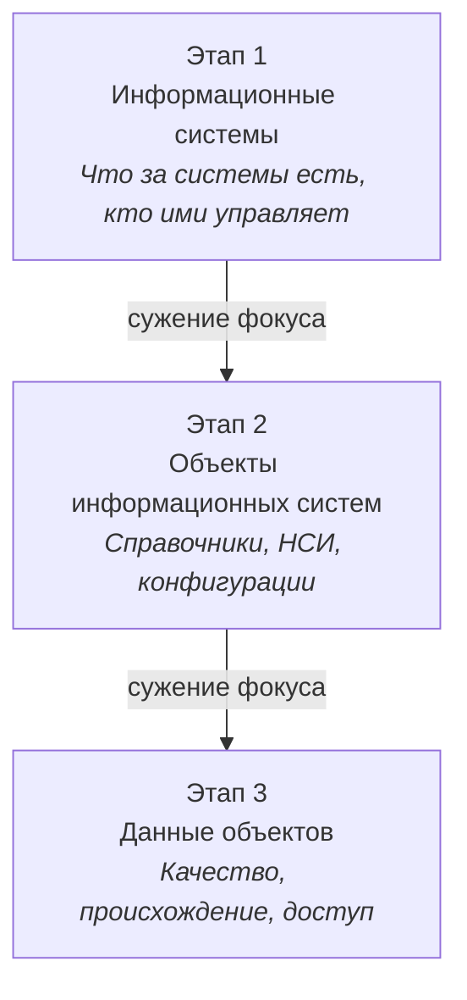

# Модель киберустойчивости через контур управления данными

**Автор:** Артём Шмарёв  
**Версия:** v0.2  
**Статус:** живой документ — обновляется по мере разработки Этапа 3  
**Тег:** #DGxCyber  

---

## Идея

Киберустойчивость нельзя построить, перескочив уровень. Модель описывает три последовательных уровня зрелости контура управления данными — от системы к её объектам, от объектов к данным внутри них.

## Модель

| Этап | Фокус | Ключевой вопрос | Статус |
|---|---|---|---|
| **1. Информационные системы** | Что за системы есть, кто ими управляет | Защищена ли система? | ✅ Представлено — [Data Summit 2026](#) |
| **2. Объекты информационных систем** | Что внутри системы требует контроля — справочники, НСИ, конфигурации | Управляемы ли объекты системы? | 🔄 Текущий этап — [вебинар с Innostage, июль 2026](#) |
| **3. Данные объектов информационных систем** | Качество, происхождение, уровни доступа | Можете ли вы это доказать? | 🛠 В разработке |

**Тезис:** контур управления данными без третьего уровня — это иллюзия контроля, а не контроль.

## Схема

*Зелёный — представлено (Data Summit 2026), жёлтый — текущий этап (вебинар с Innostage), пунктир — в разработке.*

## Почему это не про инструменты

Продукты и платформы защищают Этап 1 и частично Этап 2. Ни один инструмент не закрывает Этап 3 «из коробки» — это вопрос методологии и дисциплины, а не покупки решения.

## История версий

| Версия | Дата | Изменения |
|---|---|---|
| v0.1 | июль 2026 | Зафиксирована трёхуровневая модель. Уровень 1 представлен на Data Summit 2026, уровень 2 — на вебинаре с Innostage (2 июля 2026) |

## Развитие

Этап 3 находится в разработке. Обновления модели будут публиковаться в этом же файле по мере готовности — следите за версией в шапке документа.

---

*Модель развивается в рамках сотрудничества Юникон БСЛ с Инностейдж. Комментарии и обсуждение — через LinkedIn или issues в этом репозитории.*
