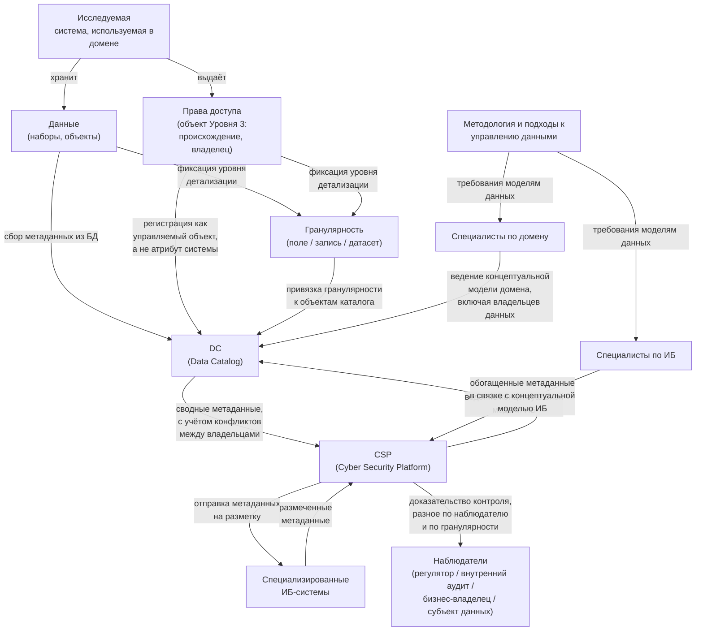

# Модель киберустойчивости через контур управления данными

**Авторы концепции:** Артём Шмарёв, Александр Тарасов, Екатерина Гафиятулина, Мария Двоеносова и другие коллеги.  
**Автор текста:** Артём Шмарёв  
**Версия:** v0.4.0  
**Статус:** модель развивается, документ обновляется по мере прохождения этапов разработки  
**Тег:** #DGxCyber  

---

## Идея модели

Киберустойчивость невозможно построить, перескочив уровни понимания и управления.

Организация не может эффективно защищать данные, если она не понимает:

- какие информационные системы существуют;
- какие объекты находятся внутри этих систем;
- какие данные формируют эти объекты;
- как данные используются, изменяются и защищаются.

Модель описывает последовательное развитие контура управления данными через три уровня зрелости:

**Система → Объект → Данные**

Каждый следующий уровень расширяет предыдущий и переводит управление от общего контроля среды к доказуемому контролю конкретных объектов и данных.

---

## Логика уровней модели

### Уровень 1. Информационные системы

**Фокус:** управление и защита информационных систем как целостных объектов.

**Основной вопрос:** какие системы существуют и кто отвечает за их состояние?

**Объекты управления:**
- информационные системы;
- владельцы систем;
- зоны ответственности;
- критичность систем;
- требования защиты.

**Результат уровня:** организация получает базовую карту цифровой среды и понимание того, какие системы требуют управления и защиты.

**Статус:** ✅ Представлено — [Data Summit 2026](https://rutube.ru/video/8cb1b9dbbdf75085ae83444295028389/?playlist=1573750)

---

### Уровень 2. Объекты информационных систем

**Фокус:** переход от управления системами к управлению объектами внутри систем.

**Основной вопрос:** что внутри системы требует контроля?

На этом уровне информационная система рассматривается не как единый объект, а как набор управляемых элементов.

**Объекты управления:**
- отчёты;
- справочники и нормативно-справочная информация (НСИ);
- бизнес-объекты;
- функциональная логика;
- процессы обработки информации;
- взаимосвязи между объектами.

**Результат уровня:** организация получает возможность понимать структуру системы и управлять не только платформой, но и содержанием, которое формирует её бизнес-ценность.

**Статус:** ✅ Представлено — [вебинар Innostage, «Юникон БСЛ» и Arenadata Catalog, 2 июля 2026](https://rutube.ru/video/7c1cba4fa0a07d7d638ec5deff2e9c63)

---

### Уровень 3. Данные объектов информационных систем

**Фокус:** переход от управления объектами к управлению данными, из которых эти объекты состоят.

**Основной вопрос:** можете ли вы доказать происхождение, качество и использование данных?

**Объекты управления:**
- состав данных;
- происхождение данных;
- владельцы данных;
- качество данных;
- уровни доступа — право доступа рассматривается как самостоятельный объект управления Уровня 3 со своим происхождением, владельцем и доказательством изменений, а не как атрибут, выдаваемый системой (Уровень 1) в обход контура;
- гранулярность данных — уровень детализации, на котором данные описываются, отслеживаются и защищаются (поле / запись / набор / датасет). Гранулярность не является отдельным изолированным параметром: она определяет, к какому уровню детализации привязано право доступа (доступ к полю ≠ доступ к таблице — разные объекты управления с разным риском), на каком уровне детализации предъявляется доказательство контроля конкретному наблюдателю (регулятору по инциденту — на уровне записи, бизнес-владельцу для оценки качества — на уровне агрегата), и часто является механизмом разрешения конфликта владельцев без выбора "или-или" (например: удаление персональных полей при сохранении обезличенного агрегата для аудита);
- правила использования;
- зависимости между данными и бизнес-процессами, включая случаи, когда у одного объекта данных несколько владельцев-наблюдателей с потенциально несовместимыми требованиями (например: требование удаления по запросу субъекта данных против требования хранения для аудита) — такие конфликты фиксируются явно и по возможности разрешаются через гранулярность (см. выше), а если это невозможно — требуют определённого механизма арбитража, а не остаются скрытым допущением модели.

**Результат уровня:** организация получает доказательную модель управления данными и может объяснить:

- откуда появились данные;
- кто отвечает за них;
- где они используются;
- какие риски связаны с их изменением или нарушением доступности;
- кому именно, на каком уровне детализации и что конкретно доказано — доказательность контроля фиксируется отдельно по каждому наблюдателю, которому она адресована (регулятор / внутренний аудит / бизнес-владелец / субъект данных), и по гранулярности, которая этому наблюдателю требуется (поле / запись / агрегат), а не как единое неразличимое свойство объекта данных.

**Статус:** 🛠 В разработке

---

## Основной тезис модели

Контур управления данными без третьего уровня — это иллюзия контроля, а не контроль.

Наличие перечня систем и объектов ещё не означает понимания данных внутри них.

Настоящая управляемость появляется только тогда, когда организация может связать:

**бизнес-процесс → объект → данные → ответственность → риск → мера защиты**

---

## Архитектура контура

```mermaid
flowchart TD
    SYSTEM["Исследуемая\n система, используемая в \nдомене"] -->|"хранит"| DATA["Данные\n(наборы, объекты)"]
    SYSTEM -->|"выдаёт"| RIGHTS["Права доступа\n(объект Уровня 3:\nпроисхождение, владелец)"]
    DATA -->|"фиксация уровня\nдетализации"| GRAN["Гранулярность\n(поле / запись / датасет)"]
    RIGHTS -->|"фиксация уровня\nдетализации"| GRAN
    DATA -->|"сбор метаданных из БД"| DC["DC\n(Data Catalog)"]
    RIGHTS -->|"регистрация как \nуправляемый объект,\nа не атрибут системы"| DC
    GRAN -->|"привязка гранулярности\nк объектам каталога"| DC
    METHODOLOGY["Методология и подходы к \nуправлению данными"] --> |"требования моделям данных"| MAN1
    METHODOLOGY["Методология и подходы к \nуправлению данными"] --> |"требования моделям данных"| MAN2
    MAN1["Специалисты по домену"] --> |"ведение концептуальной\nмодели домена,\nвключая владельцев данных"| DC
    DC -->|"сводные метаданные,\nс учётом конфликтов\nмежду владельцами"| CARDINAL["CSP\n(Cyber Security Platform)"]
    CARDINAL -->|"отправка метаданных \nна разметку"| SECSYS["Специализированные \nИБ-системы"]
    SECSYS -->|"размеченные \nметаданные"| CARDINAL
    MAN2["Специалисты по ИБ"] --> |" ведение концептуальной\nмодели ИБ"| CARDINAL
    CARDINAL -->|"обогащенные метаданные \nв связке c концептуальной \nмоделью ИБ"| DC
    CARDINAL -->|"доказательство контроля,\nразное по наблюдателю\nи по гранулярности"| OBS["Наблюдатели\n(регулятор / внутренний аудит /\nбизнес-владелец / субъект данных)"]
```
## Почему модель не про инструменты

Инструменты управления и защиты являются необходимым элементом контура, но не заменяют саму модель управления.

Платформы позволяют:

- обнаруживать события;
- хранить информацию;
- контролировать изменения;
- применять меры защиты.

Однако ни один инструмент не формирует полный третий уровень управления данными автоматически.

Управление данными — это прежде всего вопрос:

- методологии;
- ответственности;
- описания объектов;
- качества информации;
- дисциплины управления.

Инструмент усиливает модель, но не создаёт её.

---

## Связь с киберустойчивостью

Модель показывает переход от реактивного подхода к проактивному управлению.

**Традиционный подход:** обнаружить событие → расследовать → устранить последствия

**Подход модели:** понимать объект → понимать данные → понимать риск → управлять изменениями

Чем глубже организация понимает собственную информационную среду, тем выше её способность сохранять устойчивость при изменениях и инцидентах.

---

## История версий

| Версия | Дата | Изменения |
|---|---|---|
| v0.1.0 | апрель 2026 | Зафиксирована двухуровневая модель. Уровень 1 представлен на Data Summit 2026 |
| v0.2.0 | июль 2026 | Зафиксирована трёхуровневая модель. Добавлен уровень объектов информационных систем. Уровень 2 представлен совместно с Innostage и Arenadata Catalog, 2 июля 2026 |
| v0.3.0 | июль 2026 | Добавлена архитектурная схема |
| v0.4.0 | август 2026 | В Уровень 3 добавлены: (1) права доступа как самостоятельный объект управления с собственным происхождением, владельцем и доказательством изменений, а не атрибут, выдаваемый системой в обход контура; (2) явная фиксация конфликтов между множественными владельцами-наблюдателями одного объекта данных как объект арбитража; (3) доказательность контроля определена отдельно по каждому наблюдателю, которому она адресована. Архитектурная схема дополнена узлами RIGHTS и OBS (черновик, требует согласования с соавторами). В Уровень 3 добавлена гранулярность данных (поле/запись/датасет) как параметр, определяющий: детализацию права доступа, детализацию доказательства контроля по наблюдателю, и механизм разрешения конфликта владельцев без обязательного арбитража. В схему добавлен отдельный узел GRAN, к которому сходятся DATA и RIGHTS перед регистрацией в каталоге (черновик, требует согласования) |

---

## Развитие модели

Этап 3 находится в разработке.

Следующие версии будут уточнять:

- модель ответственности за данные, включая разграничение прав доступа как самостоятельного управляемого объекта;
- связь данных с рисками информационной безопасности;
- доказательность контроля по наблюдателям и по гранулярности;
- механизм арбитража конфликтов между владельцами-наблюдателями одного объекта данных — с гранулярностью как первым инструментом разрешения, до эскалации к арбитражу;
- отражение прав доступа и гранулярности отдельным контуром в архитектурной схеме, включая согласование с соавторами;
- механизмы оценки зрелости.

Обновления будут публиковаться в этом репозитории с сохранением истории изменений.

---

## Контекст разработки

Модель развивается в рамках центра компетенции по управлению данными «Юникон БСЛ».

Отдельные этапы модели демонстрировались совместно с партнёрами:

- Data Summit 2026;
- вебинар Innostage, «Юникон БСЛ» и Arenadata Catalog, 2 июля 2026.

Обсуждение и предложения по развитию модели принимаются через issues репозитория или в комментариях к постам с тегом #DGxCyber в LinkedIn.
