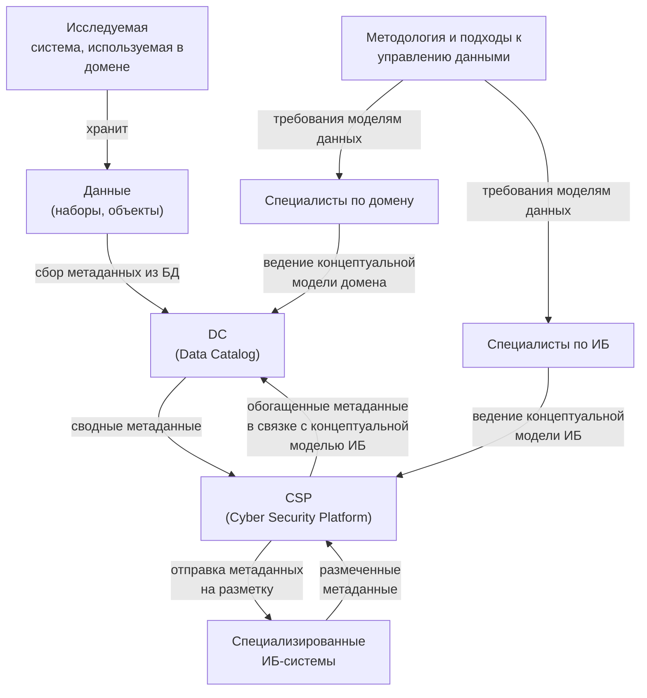

# Модель киберустойчивости через контур управления данными

**Авторы концепции:** Артём Шмарёв, Александр Тарасов, Екатерина Гафиятулина, Мария Двоеносова и другие коллеги.  
**Автор текста:** Артём Шмарёв  
**Версия:** v0.3.5  
**Статус:** модель развивается, документ обновляется по мере прохождения этапов разработки  
**Тег:** #DGxCyber  

---

## Идея модели

Киберустойчивость невозможно построить, перескочив уровни понимания и управления.

Организация не может эффективно защищать данные, если она не понимает:

- какие информационные системы существуют;
- какие объекты находятся внутри этих систем;
- какие данные формируют эти объекты;
- как данные используются, изменяются и защищаются.

Модель описывает последовательное развитие контура управления данными через три уровня зрелости:

**Система → Объект → Данные**

Каждый следующий уровень расширяет предыдущий и переводит управление от общего контроля среды к доказуемому контролю конкретных объектов и данных.

---

## Логика уровней модели

### Уровень 1. Информационные системы

**Фокус:** управление и защита информационных систем как целостных объектов.

**Основной вопрос:** какие системы существуют и кто отвечает за их состояние?

**Объекты управления:**
- информационные системы;
- владельцы систем;
- зоны ответственности;
- критичность систем;
- требования защиты.

**Результат уровня:** организация получает базовую карту цифровой среды и понимание того, какие системы требуют управления и защиты.

**Статус:** ✅ Представлено — [Data Summit 2026](https://rutube.ru/video/8cb1b9dbbdf75085ae83444295028389/?playlist=1573750)

---

### Уровень 2. Объекты информационных систем

**Фокус:** переход от управления системами к управлению объектами внутри систем.

**Основной вопрос:** что внутри системы требует контроля?

На этом уровне информационная система рассматривается не как единый объект, а как набор управляемых элементов.

**Объекты управления:**
- отчёты;
- справочники и нормативно-справочная информация (НСИ);
- бизнес-объекты;
- функциональная логика;
- процессы обработки информации;
- взаимосвязи между объектами.

**Результат уровня:** организация получает возможность понимать структуру системы и управлять не только платформой, но и содержанием, которое формирует её бизнес-ценность.

**Статус:** ✅ Представлено — [вебинар Innostage, «Юникон БСЛ» и Arenadata Catalog, 2 июля 2026](https://rutube.ru/video/7c1cba4fa0a07d7d638ec5deff2e9c63)

---

### Уровень 3. Данные объектов информационных систем

**Фокус:** переход от управления объектами к управлению данными, из которых эти объекты состоят.

**Основной вопрос:** можете ли вы доказать происхождение, качество и использование данных?

**Объекты управления:**
- состав данных;
- происхождение данных;
- владельцы данных;
- качество данных;
- уровни доступа;
- правила использования;
- зависимости между данными и бизнес-процессами.

**Результат уровня:** организация получает доказательную модель управления данными и может объяснить:

- откуда появились данные;
- кто отвечает за них;
- где они используются;
- какие риски связаны с их изменением или нарушением доступности.

**Статус:** 🛠 В разработке

---

## Основной тезис модели

Контур управления данными без третьего уровня — это иллюзия контроля, а не контроль.

Наличие перечня систем и объектов ещё не означает понимания данных внутри них.

Настоящая управляемость появляется только тогда, когда организация может связать:

**бизнес-процесс → объект → данные → ответственность → риск → мера защиты**

---

## Архитектура контура

```mermaid
flowchart TD
    SYSTEM["Исследуемая\n система, используемая в \nдомене"] -->|"хранит"| DATA["Данные\n(наборы, объекты)"]
    DATA -->|"сбор метаданных из БД"| DC["DC\n(Data Catalog)"]
    METHODOLOGY["Методология и подходы к \nуправлению данными"] --> |"требования моделям данных"| MAN1
    METHODOLOGY["Методология и подходы к \nуправлению данными"] --> |"требования моделям данных"| MAN2
    MAN1["Специалисты по домену"] --> |"ведение концептуальной\nмодели домена"| DC
    DC -->|"сводные метаданные"| CARDINAL["CSP\n(Cyber Security Platform)"]
    CARDINAL -->|"отправка метаданных \nна разметку"| SECSYS["Специализированные \nИБ-системы"]
    SECSYS -->|"размеченные \nметаданные"| CARDINAL
    MAN2["Специалисты по ИБ"] --> |" ведение концептуальной\nмодели ИБ"| CARDINAL
    CARDINAL -->|"обогащенные метаданные \nв связке c концептуальной \nмоделью ИБ"| DC
```
---

## Почему модель не про инструменты

Инструменты управления и защиты являются необходимым элементом контура, но не заменяют саму модель управления.

Платформы позволяют:

- обнаруживать события;
- хранить информацию;
- контролировать изменения;
- применять меры защиты.

Однако ни один инструмент не формирует полный третий уровень управления данными автоматически.

Управление данными — это прежде всего вопрос:

- методологии;
- ответственности;
- описания объектов;
- качества информации;
- дисциплины управления.

Инструмент усиливает модель, но не создаёт её.

---

## Связь с киберустойчивостью

Модель показывает переход от реактивного подхода к проактивному управлению.

**Традиционный подход:** обнаружить событие → расследовать → устранить последствия

**Подход модели:** понимать объект → понимать данные → понимать риск → управлять изменениями

Чем глубже организация понимает собственную информационную среду, тем выше её способность сохранять устойчивость при изменениях и инцидентах.

---

## Сопоставимость принципов в разных юрисдикциях

Таблица показывает, что базовые принципы модели (Система → Объект → Данные) присутствуют в нормативных подходах России, Китая, ЕС, США и Индии.

Цель таблицы — обеспечить сопоставимость этих принципов и дать возможность использовать конкретные механизмы реализации из разных юрисдикций при построении и развитии контура управления данными.

| Уровень модели | Принцип / механизм | 🇷🇺 Россия | 🇨🇳 Китай | 🇪🇺 ЕС | 🇺🇸 США | 🇮🇳 Индия |
| :--- | :--- | :--- | :--- | :--- | :--- | :--- |
| **1. Система** | Инфраструктурный суверенитет и контроль периметра | Локализация объектов критической информационной инфраструктуры (КИИ), требования импортозамещения ПО и оборудования, механизмы контроля сетевого периметра («суверенный интернет»). | Требования локального хранения данных критической информационной инфраструктуры (CII), государственный контроль инфраструктуры, требования технологической автономии. | Требования устойчивости ICT-инфраструктуры (NIS2, CER), инициативы digital sovereignty (GAIA-X, EuroHPC), обеспечение операционной непрерывности. | Требования контроля цепочек поставок и вычислительных мощностей для федеральных систем (CHIPS Act, executive orders), FedRAMP. | Развитие национального ИИ-стека и вычислительных мощностей (IndiaAI Mission), секторальные требования к самообеспеченности. |
| **1. Система** | Контроль трансграничных потоков данных | Требование локализации персональных данных граждан РФ (152-ФЗ, 242-ФЗ), уведомление Роскомнадзора о трансграничной передаче. | Требование security assessment для трансграничной передачи персональных и important data (PIPL, Data Security Law, Cybersecurity Law). | Механизмы адекватности, Standard Contractual Clauses (SCC), Binding Corporate Rules (BCR), Transfer Impact Assessment (после Schrems II). | Секторальные ограничения на передачу чувствительных данных, действие CLOUD Act. | Механизм ограничения передачи в определённые страны (DPDP Act, раздел 16), секторальная локализация (в т.ч. RBI для платёжных данных). |
| **2. Объект** | Инвентаризация и категорирование | Учёт и категоризация объектов КИИ и критических информационных систем. | Государственное категорирование данных (core data / important data / general data) и информационных систем. | Документирование и регистрация high-risk AI-систем и критических ICT-систем (AI Act, NIS2). | Инвентаризация ИИ-активов и cyber-активов федеральных систем (требования OMB, CISA). | Классификация AI-систем по уровню риска, учёт significant data fiduciaries. |
| **2. Объект** | Ответственность владельца / оператора | Назначение ответственных за безопасность объектов КИИ и операторов персональных данных. | Ответственность data handler, service provider и platform operator. | Разделение ролей provider, deployer и user (AI Act); ответственность controller (GDPR). | Определение system owners и границ ответственности в федеральных и секторальных системах. | Graded responsibility: data fiduciary, significant data fiduciary, consent manager (DPDP Act). |
| **3. Данные** | Управление качеством и легитимностью данных | Специализированные требования к качеству и легитимности данных, используемых для обучения ИИ-моделей, на уровне федерального регулирования не закреплены; вопрос охватывается общими нормами защиты персональных данных и коммерческой тайны. | Требования легитимности, подконтрольности и безопасности данных, используемых для обучения моделей. | Требования к качеству, репрезентативности и минимизации bias обучающих данных (AI Act, ст. 10). | Требования управления рисками данных и защиты от data poisoning (NIST AI RMF). | Требование согласия как основания обработки данных для обучения, требования точности и минимизации. |
| **3. Данные** | Гранулярный контроль доступа | Разграничение прав доступа к информационным системам, базам знаний и объектам КИИ. | Контроль доступа к данным в соответствии с их категорией, требования аудита. | Контроль доступа и наличие правовых оснований обработки (GDPR + AI Act). | Требования контроля доступа, least privilege, минимизация рисков компрометации. | Обязанности data fiduciary и significant data fiduciary, принцип purpose limitation. |
| **3. Данные** | Прослеживаемость происхождения данных | Отраслевые требования к прослеживаемости происхождения данных отсутствуют; практика построения карт происхождения данных формируется в рамках корпоративных подходов к data governance. | Требования подконтрольности источников обучающих данных, обязательная маркировка синтетического контента. | Требования документации датасетов, проверяемости источников и logging (AI Act). | Требования документирования происхождения и lineage данных (NIST AI RMF, federal guidance). | Требования маркировки синтетического контента, требования transparency. |

**Примечание:** Ячейка отражает наличие или отсутствие специализированной нормы на момент публикации, а не сравнительную оценку регуляторных режимов.

---

## История версий

| Версия | Дата | Изменения |
|---|---|---|
| v0.1.0 | апрель 2026 | Зафиксирована двухуровневая модель. Уровень 1 представлен на Data Summit 2026 |
| v0.2.0 | июль 2026 | Зафиксирована трёхуровневая модель. Добавлен уровень объектов информационных систем. Уровень 2 представлен совместно с Innostage и Arenadata Catalog, 2 июля 2026 |
| v0.3.0 | июль 2026 | Добавлена архитектурная схема |
| v0.3.5 | сентябрь 2026 | Добавлена сравнительная таблица принципов киберустойчивости по юрисдикциям |

---

## Развитие модели

Этап 3 находится в разработке.

Следующие версии будут уточнять:

- модель ответственности за данные;
- связь данных с рисками информационной безопасности;
- доказательность контроля;
- механизмы оценки зрелости.

Обновления будут публиковаться в этом репозитории с сохранением истории изменений.

---

## Контекст разработки

Модель развивается в рамках центра компетенции по управлению данными «Юникон БСЛ».

Отдельные этапы модели демонстрировались совместно с партнёрами:

- Data Summit 2026;
- вебинар Innostage, «Юникон БСЛ» и Arenadata Catalog, 2 июля 2026.

Обсуждение и предложения по развитию модели принимаются через issues репозитория или в комментариях к постам с тегом #DGxCyber в LinkedIn.
